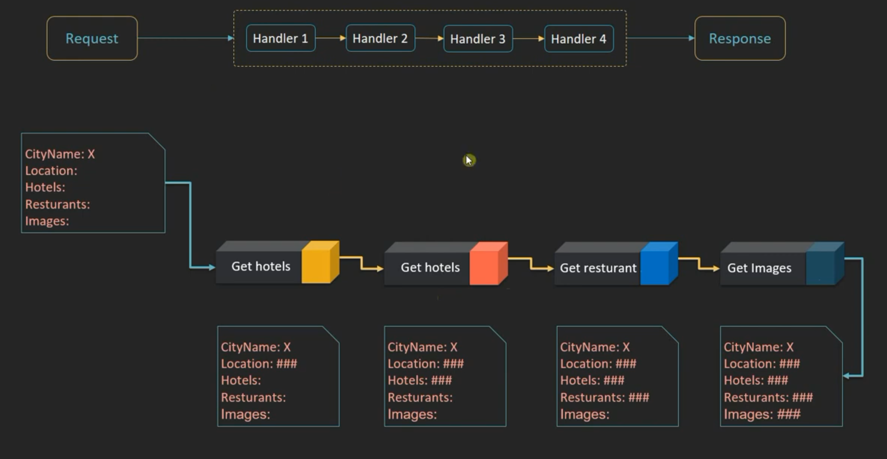
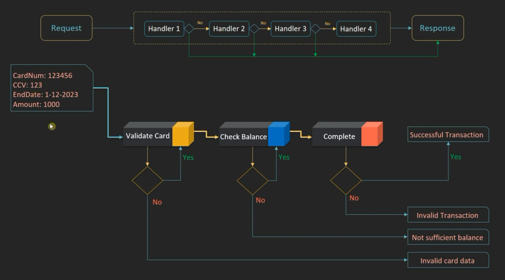

# Chain of Responsibility Pattern

## Overview

The **Chain of Responsibility** is a behavioral design pattern that allows a request to pass through a chain of handlers.

Instead of sending a request directly to a specific object, the sender passes the request to the first handler in the chain. Each handler can process the request and then pass it to the next handler.

---

## Intent

> Pass a request along a chain of handlers, allowing each handler to process it before passing it to the next handler.

The pattern decouples the sender of a request from the objects that process it.

---

## Chain Structure — First Scenario

In the first scenario, the request passes through **all handlers**. Each handler can process or modify the request before passing it to the next handler. The final response is returned after all handlers have processed the request.

<p align="center">
  
</p>

### Flow

```text
Request
   ↓
Handler A → Process & Pass
   ↓
Handler B → Process & Pass
   ↓
Handler C → Process & Pass
   ↓
Final Response
```

---

## Chain Structure — Second Scenario

In the second scenario, each handler checks whether it can handle the request. If it can, the request is handled and the chain stops. Otherwise, the request is passed to the next handler.

<p align="center">
  
</p>

### Flow
 
```text
Request
   ↓
Handler A
   │
   ├── Can Handle? ── Yes ──→ Handle Request → Done
   │
   └── No
       ↓
   Handler B
       │
       ├── Can Handle? ── Yes ──→ Handle Request → Done
       │
       └── No
           ↓
       Handler C
           │
           ├── Can Handle? ── Yes ──→ Handle Request → Done
           │
           └── No ──→ End / Not Handled
```

---

## What Problem Does It Solve?

Without Chain of Responsibility, a class may contain a large number of conditional statements:

```java
if (requestType == TYPE_A) {
    // Handle request
} else if (requestType == TYPE_B) {
    // Handle request
} else if (requestType == TYPE_C) {
    // Handle request
}
```

This can make the code tightly coupled and difficult to maintain.

With Chain of Responsibility, each handler is responsible for a specific part of the request-processing logic.

```text
Request
   ↓
Handler A
   ↓
Handler B
   ↓
Handler C
   ↓
Response
```

---

## When Should We Use It?

Use Chain of Responsibility when:

- Multiple objects may handle the same request.
- The handler should be determined dynamically.
- You want to avoid large `if/else` or `switch` statements.
- The request needs to pass through multiple processing stages.
- You want to add or remove handlers without changing the client.
- You want to reduce coupling between the sender and receivers.

---

## Real-World Example

A common example is an **IT Support System**:

```text
Customer Request
       ↓
Level 1 Support
       ↓
Level 2 Support
       ↓
Level 3 Support
       ↓
Engineering Team
```

Each support level can process the request and decide whether it should be passed to the next level.

---

## Advantages

- **Loose Coupling** — The client does not need to know which handler processes the request.
- **Flexible Chain** — Handlers can be added, removed, or reordered.
- **Better Maintainability** — Each handler contains a focused responsibility.
- **Extensible** — New handlers can be introduced without changing existing handlers.
- **Single Responsibility** — Each handler can focus on a specific processing task.

---

## Disadvantages

- A request may reach the end of the chain without being handled.
- A long chain can increase processing time.
- Debugging can be more difficult because the request passes through multiple objects.
- The chain must be configured correctly.

---

## Key Idea

The main idea behind Chain of Responsibility is:

> **A request can be passed through a sequence of handlers without the sender knowing which handler will process it.**

Depending on the implementation, the chain can either:

1. Pass the request through **all handlers**.
2. Stop when the **first suitable handler** processes the request.

---

## Summary

The **Chain of Responsibility Pattern** creates a chain of handlers through which a request can travel.

Each handler can either:

- Process the request and pass it to the next handler.
- Process the request and stop the chain.
- Decide not to process the request and forward it.

This makes the pattern useful for request pipelines, validation, logging, authentication, authorization, middleware, and approval workflows.